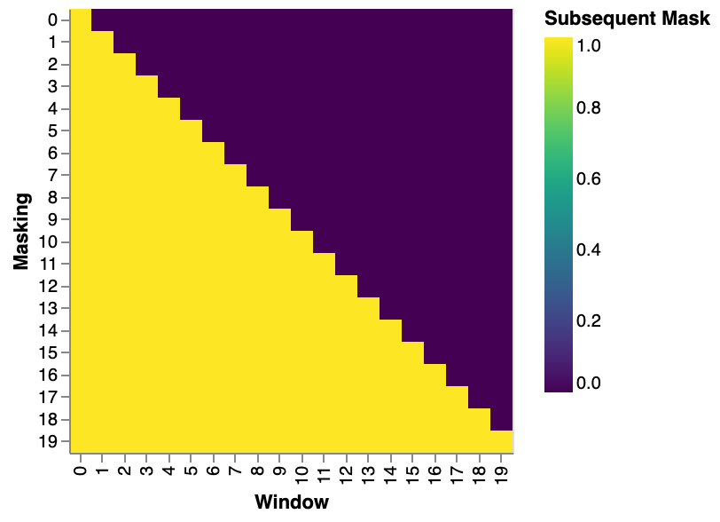
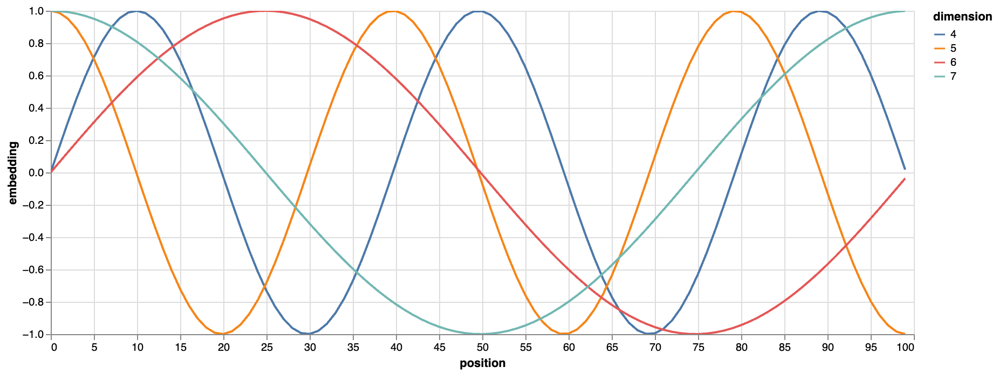
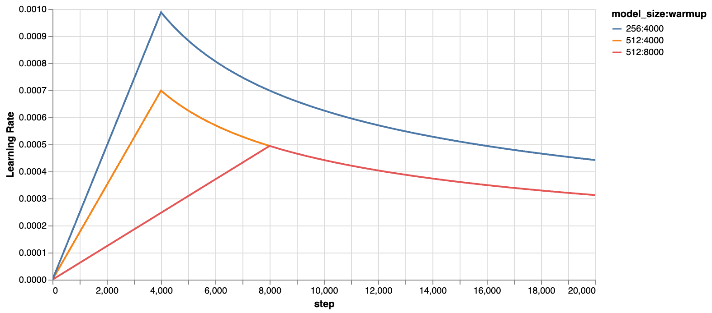
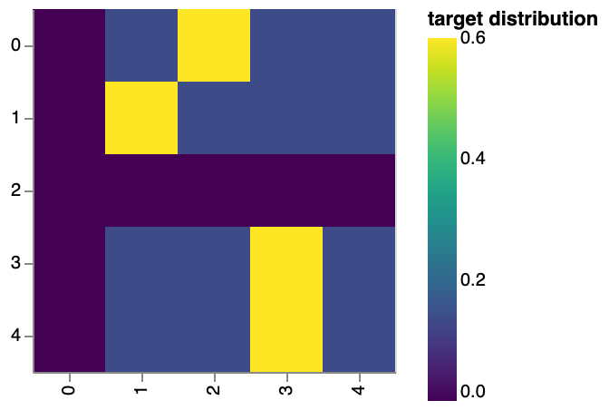
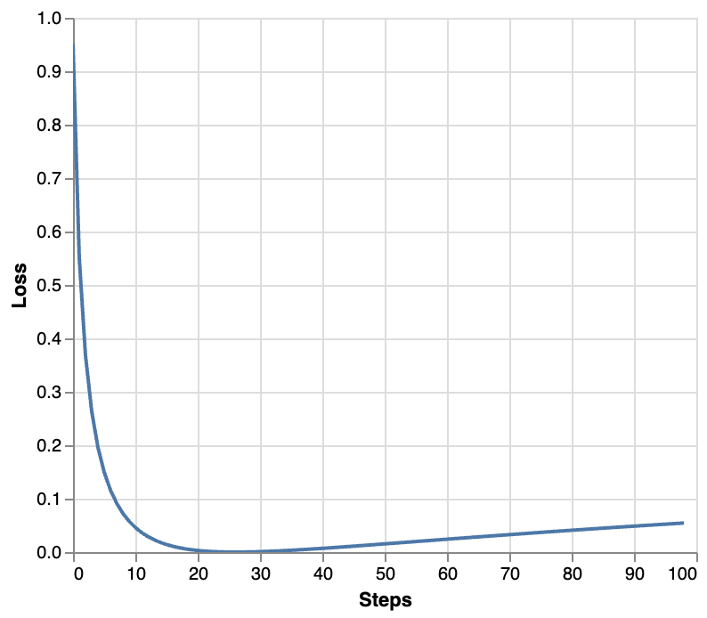
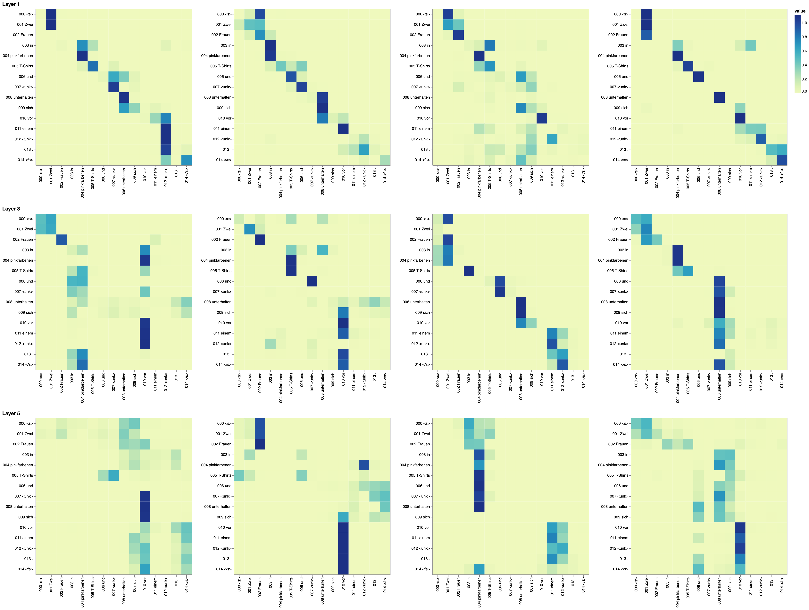
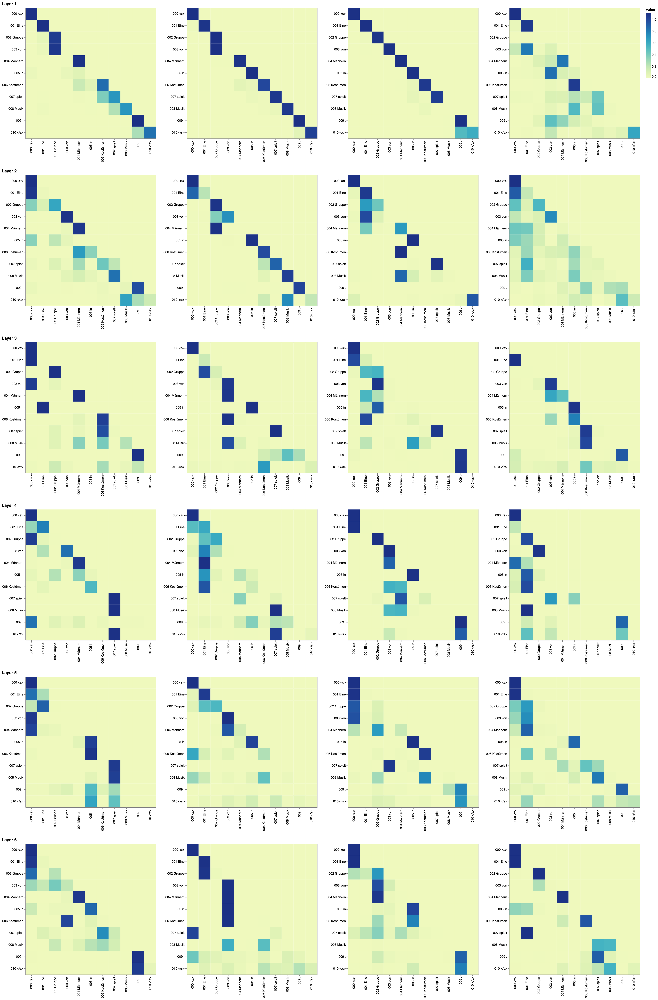

# 带注释的Transformer

## [你只需要专注力](https://arxiv.org/abs/1706.03762)


- *v2022：Austin Huang、Suraj Subramanian、Jonathan Sum、Khalid Almubarak 和 Stella Biderman。*
- *[原作者](https://nlp.seas.harvard.edu/2018/04/03/attention.html)：[Sasha Rush](http://rush-nlp.com/)。*

过去五年间，Transformer 一直是许多人关注的焦点。本文以逐行实现的形式呈现了该论文的注释版本。它对原论文的部分内容进行了重新排序和删减，并添加了注释。本文档本身就是一个可运行的 notebook，应该是一个完全可用的实现。代码可[在此处](https://github.com/harvardnlp/annotated-transformer/)获取。

### 目录

- [预赛](#prelims)
- [背景](#background)
- [第一部分：模型架构](#part-1-model-architecture)
- [模型架构](#model-architecture)
  - [编码器和解码器协议栈](#encoder-and-decoder-stacks)
  - [位置前馈网络](#position-wise-feed-forward-networks)
  - [嵌入和 Softmax](#embeddings-and-softmax)
  - [位置编码](#positional-encoding)
  - [全尺寸](#full-model)
  - [推理：](#inference)
- [第二部分：模型训练](#part-2-model-training)
- [训练](#training)
  - [批次和掩膜](#batches-and-masking)
  - [训练循环](#training-loop)
  - [训练数据和批处理](#training-data-and-batching)
  - [硬件和日程安排](#hardware-and-schedule)
  - [优化器](#optimizer)
  - [正则化](#regularization)
- [第一个例子](#a-first-example)
  - [合成数据](#synthetic-data)
  - [损失计算](#loss-computation)
  - [贪婪解码](#greedy-decoding)
- [第三部分：一个真实案例](#part-3-a-real-world-example)
  - [数据加载](#data-loading)
  - [迭代器](#iterators)
  - [训练系统](#training-the-system)
- [其他组件：BPE、搜索、平均值](#additional-components-bpe-search-averaging)
- [结果](#results)
  - [注意力可视化](#attention-visualization)
  - [编码器自注意力](#encoder-self-attention)
  - [解码器自我注意力](#decoder-self-attention)
  - [解码器源注意力](#decoder-src-attention)
- [结论](#conclusion)

# 预赛

[跳过](#background)

```python
# !pip install -r requirements.txt
# # Uncomment for colab
# #
# !pip install -q torchdata==0.3.0 torchtext==0.12 spacy==3.2 altair GPUtil
# !python -m spacy download de_core_news_sm
# !python -m spacy download en_core_web_sm
import os
from os.path import exists
import torch
import torch.nn as nn
from torch.nn.functional import log_softmax, pad
import math
import copy
import time
from torch.optim.lr_scheduler import LambdaLR
import pandas as pd
import altair as alt
from torchtext.data.functional import to_map_style_dataset
from torch.utils.data import DataLoader
from torchtext.vocab import build_vocab_from_iterator
import torchtext.datasets as datasets
import spacy
import GPUtil
import warnings
from torch.utils.data.distributed import DistributedSampler
import torch.distributed as dist
import torch.multiprocessing as mp
from torch.nn.parallel import DistributedDataParallel as DDP


# Set to False to skip notebook execution (e.g. for debugging)
warnings.filterwarnings("ignore")
RUN_EXAMPLES = True
# Some convenience helper functions used throughout the notebook


def is_interactive_notebook():
    return __name__ == "__main__"


def show_example(fn, args=[]):
    if __name__ == "__main__" and RUN_EXAMPLES:
        return fn(*args)


def execute_example(fn, args=[]):
    if __name__ == "__main__" and RUN_EXAMPLES:
        fn(*args)


class DummyOptimizer(torch.optim.Optimizer):
    def __init__(self):
        self.param_groups = [{"lr": 0}]
        None

    def step(self):
        None

    def zero_grad(self, set_to_none=False):
        None


class DummyScheduler:
    def step(self):
        None
```

> 我的评论已用引用块括起来。正文全部摘自论文原文。

# 背景

减少顺序计算的目标也是扩展神经GPU、ByteNet和ConvS2S的基础，它们都以卷积神经网络为基本构建模块，并行计算所有输入和输出位置的隐藏表示。在这些模型中，关联两个任意输入或输出位置的信号所需的运算次数会随着位置间距离的增加而增长，ConvS2S呈线性增长，ByteNet呈对数增长。这使得学习远距离位置之间的依赖关系变得更加困难。在Transformer中，运算次数减少到恒定值，但代价是由于对注意力加权位置进行平均而降低了有效分辨率，我们通过多头注意力机制来抵消这种影响。

自注意力机制（有时也称为序列内注意力机制）是一种将单个序列的不同位置关联起来以计算序列表示的注意力机制。自注意力机制已成功应用于多种任务，包括阅读理解、抽象式文本摘要、文本蕴含以及学习与任务无关的句子表示。端到端记忆网络基于循环注意力机制而非序列对齐循环，并且已证明在简单语言问答和语言建模任务中表现良好。

但据我们所知，Transformer 是第一个完全依靠自注意力机制来计算其输入和输出表示，而无需使用序列对齐的 RNN 或卷积的转换模型。

# 第一部分：模型架构

# 模型架构

大多数具有竞争力的神经序列转换模型都具有编码器-解码器结构[（引用）](https://arxiv.org/abs/1409.0473)。其中，编码器将输入的符号表示（x1，。。。，xn）序列映射到解码器一系列连续表示z=（z1，。。。，zn）。给定**z**，解码器生成一个输出序列（y1，。。。，ym）每次处理一个符号元素。在每一步中，模型都是自回归的[（引用）](https://arxiv.org/abs/1308.0850)，在生成下一个符号时，会将先前生成的符号作为额外的输入。

```python
class EncoderDecoder(nn.Module):
    """
    A standard Encoder-Decoder architecture. Base for this and many
    other models.
    """

    def __init__(self, encoder, decoder, src_embed, tgt_embed, generator):
        super(EncoderDecoder, self).__init__()
        self.encoder = encoder
        self.decoder = decoder
        self.src_embed = src_embed
        self.tgt_embed = tgt_embed
        self.generator = generator

    def forward(self, src, tgt, src_mask, tgt_mask):
        "Take in and process masked src and target sequences."
        return self.decode(self.encode(src, src_mask), src_mask, tgt, tgt_mask)

    def encode(self, src, src_mask):
        return self.encoder(self.src_embed(src), src_mask)

    def decode(self, memory, src_mask, tgt, tgt_mask):
        return self.decoder(self.tgt_embed(tgt), memory, src_mask, tgt_mask)
class Generator(nn.Module):
    "Define standard linear + softmax generation step."

    def __init__(self, d_model, vocab):
        super(Generator, self).__init__()
        self.proj = nn.Linear(d_model, vocab)

    def forward(self, x):
        return log_softmax(self.proj(x), dim=-1)
```

Transformer 遵循这种整体架构，编码器和解码器分别采用堆叠式自注意力层和逐点全连接层，如图 1 的左半部分和右半部分所示。


## 编码器和解码器协议栈

### 编码器

编码器由一叠N=6相同的层组成。

```python
def clones(module, N):
    "Produce N identical layers."
    return nn.ModuleList([copy.deepcopy(module) for _ in range(N)])
class Encoder(nn.Module):
    "Core encoder is a stack of N layers"

    def __init__(self, layer, N):
        super(Encoder, self).__init__()
        self.layers = clones(layer, N)
        self.norm = LayerNorm(layer.size)

    def forward(self, x, mask):
        "Pass the input (and mask) through each layer in turn."
        for layer in self.layers:
            x = layer(x, mask)
        return self.norm(x)
```

我们在两个子层之间采用残差连接[（引用） ](https://arxiv.org/abs/1512.03385)，然后进行层归一化[（引用）](https://arxiv.org/abs/1607.06450)。

```python
class LayerNorm(nn.Module):
    "Construct a layernorm module (See citation for details)."

    def __init__(self, features, eps=1e-6):
        super(LayerNorm, self).__init__()
        self.a_2 = nn.Parameter(torch.ones(features))
        self.b_2 = nn.Parameter(torch.zeros(features))
        self.eps = eps

    def forward(self, x):
        mean = x.mean(-1, keepdim=True)
        std = x.std(-1, keepdim=True)
        return self.a_2 * (x - mean) / (std + self.eps) + self.b_2
```

也就是说，每个子层的输出是一个LayerNorm(x+Sublayer(x))， 在那里SubLayer(x)是子层自身实现的函数。我们对每个子层的输出应用 dropout [（参见引用）](http://jmlr.org/papers/v15/srivastava14a.html)，然后再将其添加到子层输入并进行归一化。

为了促进这些残差连接，模型中的所有子层以及嵌入层都会产生维度为$d_{model}=512$的输出。

```python
class SublayerConnection(nn.Module):
    """
    A residual connection followed by a layer norm.
    Note for code simplicity the norm is first as opposed to last.
    """

    def __init__(self, size, dropout):
        super(SublayerConnection, self).__init__()
        self.norm = LayerNorm(size)
        self.dropout = nn.Dropout(dropout)

    def forward(self, x, sublayer):
        "Apply residual connection to any sublayer with the same size."
        return x + self.dropout(sublayer(self.norm(x)))
```

每一层都有两个子层。第一层是多头自注意力机制，第二层是一个简单的、按位置全连接的前馈网络。

```python
class EncoderLayer(nn.Module):
    "Encoder is made up of self-attn and feed forward (defined below)"

    def __init__(self, size, self_attn, feed_forward, dropout):
        super(EncoderLayer, self).__init__()
        self.self_attn = self_attn
        self.feed_forward = feed_forward
        self.sublayer = clones(SublayerConnection(size, dropout), 2)
        self.size = size

    def forward(self, x, mask):
        "Follow Figure 1 (left) for connections."
        x = self.sublayer[0](x, lambda x: self.self_attn(x, x, x, mask))
        return self.sublayer[1](x, self.feed_forward)
```

### 解码器

解码器也由一个N=6相同的层堆栈组成。

```python
class Decoder(nn.Module):
    "Generic N layer decoder with masking."

    def __init__(self, layer, N):
        super(Decoder, self).__init__()
        self.layers = clones(layer, N)
        self.norm = LayerNorm(layer.size)

    def forward(self, x, memory, src_mask, tgt_mask):
        for layer in self.layers:
            x = layer(x, memory, src_mask, tgt_mask)
        return self.norm(x)
```

除了每个编码器层中的两个子层之外，解码器还插入了第三个子层，该子层对编码器堆栈的输出执行多头注意力机制。与编码器类似，我们在每个子层周围都使用了残差连接，然后进行层归一化。

```python
class DecoderLayer(nn.Module):
    "Decoder is made of self-attn, src-attn, and feed forward (defined below)"

    def __init__(self, size, self_attn, src_attn, feed_forward, dropout):
        super(DecoderLayer, self).__init__()
        self.size = size
        self.self_attn = self_attn
        self.src_attn = src_attn
        self.feed_forward = feed_forward
        self.sublayer = clones(SublayerConnection(size, dropout), 3)

    def forward(self, x, memory, src_mask, tgt_mask):
        "Follow Figure 1 (right) for connections."
        m = memory
        x = self.sublayer[0](x, lambda x: self.self_attn(x, x, x, tgt_mask))
        x = self.sublayer[1](x, lambda x: self.src_attn(x, m, m, src_mask))
        return self.sublayer[2](x, self.feed_forward)
```

我们还修改了解码器堆栈中的自注意力子层，以防止位置关注后续位置。这种掩蔽，再加上输出嵌入偏移一个位置的方式，确保了位置$i$的预测只能依赖于位置小于$i$的已知输出。

```python
def subsequent_mask(size):
    "Mask out subsequent positions."
    attn_shape = (1, size, size)
    subsequent_mask = torch.triu(torch.ones(attn_shape), diagonal=1).type(
        torch.uint8
    )
    return subsequent_mask == 0
```

> 下方注意力掩码显示了每个目标词（行）允许关注的位置（列）。在训练期间，单词会被屏蔽，无法关注后续单词。

```python
def example_mask():
    LS_data = pd.concat(
        [
            pd.DataFrame(
                {
                    "Subsequent Mask": subsequent_mask(20)[0][x, y].flatten(),
                    "Window": y,
                    "Masking": x,
                }
            )
            for y in range(20)
            for x in range(20)
        ]
    )

    return (
        alt.Chart(LS_data)
        .mark_rect()
        .properties(height=250, width=250)
        .encode(
            alt.X("Window:O"),
            alt.Y("Masking:O"),
            alt.Color("Subsequent Mask:Q", scale=alt.Scale(scheme="viridis")),
        )
        .interactive()
    )


show_example(example_mask)
```



### 注意力

注意力函数可以描述为将查询和一组键值对映射到输出，其中查询、键、值和输出都是向量。输出计算为值的加权和，每个值的权重由查询与其对应键的兼容性函数计算得出。

我们将这种特殊的注意力机制称为“缩放点积注意力机制”。输入包括查询$d_k$和维度键$d_v$。我们计算查询与所有键的点积，并将每个点积除以$\sqrt{d_k}$并应用 softmax 函数来获得这些值的权重。


在实践中，我们同时对一组查询计算注意力函数，并将这些查询打包到一个矩阵中。问*问*键和值也被打包成矩阵。K*K*和V*V*我们按如下方式计算输出矩阵：
$$
Attention(Q,K,V)=softmax(\frac{QK^T}{\sqrt{d_k}})V
$$

```python
def attention(query, key, value, mask=None, dropout=None):
    "Compute 'Scaled Dot Product Attention'"
    d_k = query.size(-1)
    scores = torch.matmul(query, key.transpose(-2, -1)) / math.sqrt(d_k)
    if mask is not None:
        scores = scores.masked_fill(mask == 0, -1e9)
    p_attn = scores.softmax(dim=-1)
    if dropout is not None:
        p_attn = dropout(p_attn)
    return torch.matmul(p_attn, value), p_attn
```

最常用的两种注意力函数是加性注意力[（引用）](https://arxiv.org/abs/1409.0473)和点积（乘性）注意力。点积注意力与我们的算法相同，只是缩放因子$\frac{1}{\sqrt{d_k}}$不同。加性注意力机制使用具有单个隐藏层的前馈网络来计算兼容性函数。虽然两者在理论上的复杂度相似，但点积注意力机制在实践中速度更快、空间效率更高，因为它可以使用高度优化的矩阵乘法代码来实现。

对于较小的值$d_k$这两种机制表现相似，对于较大的值$d_k$，加性注意力机制在不进行缩放的情况下优于点积注意力机制 [（引用）](https://arxiv.org/abs/1703.03906)。我们怀疑，对于较大的值$d_k$点积的纲量会变得很大，从而将softmax函数推向梯度极小的区域（为了说明为什么点积会变大，假设分量为q和k是均值为0和方差为1的独立随机变量，然后它们的点积，$q⋅k=\sum^{d_k}_{i=1}q_ik_i$具有均值0和方差$d_k$。为了抵消这种影响，我们将点积按比例缩放$\frac{1}{\sqrt{d_k}}$。


多头注意力机制允许模型同时关注来自不同表征子空间、位于不同位置的信息。而单头注意力机制则会通过平均来抑制这种能力。

$$
MultiHead(Q,K,V)=Concat(head_1,...,head_h)W^O \\ where \, head_i=Attention(QW^Q_i,KW^K_i,VW^V_i)
$$

其中投影是参数矩阵
$$
W^Q_i\in\R^{d_{model}\times d_k},W^K_i\in\R^{d_{model}\times d_k},W^V_i\in\R^{d_{model}\times d_v},and \,W^O\in\R^{hd_v\times d_{model}}
$$


在这项工作中，我们采用h=8并行的注意力层，或者说注意力头。对于每一个注意力头，我们都使用$d_k=d_v=d_{model}/h=64$。由于每个注意力头的维度降低，总计算成本与全维度的单头注意力类似。

```python
class MultiHeadedAttention(nn.Module):
    def __init__(self, h, d_model, dropout=0.1):
        "Take in model size and number of heads."
        super(MultiHeadedAttention, self).__init__()
        assert d_model % h == 0
        # We assume d_v always equals d_k
        self.d_k = d_model // h
        self.h = h
        self.linears = clones(nn.Linear(d_model, d_model), 4)
        self.attn = None
        self.dropout = nn.Dropout(p=dropout)

    def forward(self, query, key, value, mask=None):
        "Implements Figure 2"
        if mask is not None:
            # Same mask applied to all h heads.
            mask = mask.unsqueeze(1)
        nbatches = query.size(0)

        # 1) Do all the linear projections in batch from d_model => h x d_k
        query, key, value = [
            lin(x).view(nbatches, -1, self.h, self.d_k).transpose(1, 2)
            for lin, x in zip(self.linears, (query, key, value))
        ]

        # 2) Apply attention on all the projected vectors in batch.
        x, self.attn = attention(
            query, key, value, mask=mask, dropout=self.dropout
        )

        # 3) "Concat" using a view and apply a final linear.
        x = (
            x.transpose(1, 2)
            .contiguous()
            .view(nbatches, -1, self.h * self.d_k)
        )
        del query
        del key
        del value
        return self.linears[-1](x)
```

### 注意力机制在我们模型中的应用

Transformer模型以三种不同的方式使用多头注意力机制：

1. 在“编码器-解码器注意力”层中，查询来自前一个解码器层，记忆键和值来自编码器的输出。这使得解码器中的每个位置都能关注输入序列中的所有位置。这模拟了在序列到序列模型中典型的编码器-解码器注意力机制，例如[[参考文献\]）](https://arxiv.org/abs/1609.08144)。
2. 编码器包含自注意力层。在自注意力层中，所有键、值和查询都来自同一位置，在本例中，即编码器前一层的输出。编码器中的每个位置都可以关注其前一层中的所有位置。
3. 类似地，解码器中的自注意力层允许解码器中的每个位置关注解码器中直至该位置的所有位置。我们需要阻止解码器中信息的左向流动，以保持自回归特性。我们在缩放点积注意力机制中实现这一点，方法是屏蔽掉（设置为−∞）softmax 输入中所有对应于非法连接的值。

## 位置前馈网络

除了注意力子层之外，我们的编码器和解码器中的每一层都包含一个全连接前馈网络，该网络分别且相同地应用于每个位置。它由两个线性变换组成，中间夹有 ReLU 激活函数。

$$
FFN(x)=max(0,xW_1+b_1)W_2+b_2
$$


虽然不同位置的线性变换相同，但它们在每一层使用的参数都不同。另一种描述方式是将其视为两个卷积核大小为 1 的卷积运算。输入和输出的维度分别为$d_{model}=512$, 并且内层具有维度$d_{ff}=2048$。

```python
class PositionwiseFeedForward(nn.Module):
    "Implements FFN equation."

    def __init__(self, d_model, d_ff, dropout=0.1):
        super(PositionwiseFeedForward, self).__init__()
        self.w_1 = nn.Linear(d_model, d_ff)
        self.w_2 = nn.Linear(d_ff, d_model)
        self.dropout = nn.Dropout(dropout)

    def forward(self, x):
        return self.w_2(self.dropout(self.w_1(x).relu()))
```

## 嵌入和 Softmax

与其他序列转导模型类似，我们使用学习到的嵌入向量将输入词元和输出词元转换为维度为$d_{model}$的向量。我们还使用常用的学习线性变换和softmax函数将解码器输出转换为预测的下一个词元概率。在我们的模型中，两个嵌入层和softmax前的线性变换共享同一个权重矩阵，类似于[（引用）](https://arxiv.org/abs/1608.05859)。在嵌入层中，我们将这些权重乘以$\sqrt{d_{model}}$。

```python
class Embeddings(nn.Module):
    def __init__(self, d_model, vocab):
        super(Embeddings, self).__init__()
        self.lut = nn.Embedding(vocab, d_model)
        self.d_model = d_model

    def forward(self, x):
        return self.lut(x) * math.sqrt(self.d_model)
```

## 位置编码

由于我们的模型不包含循环和卷积，为了使模型能够利用序列的顺序，我们必须注入一些关于序列中词元相对或绝对位置的信息。为此，我们在编码器和解码器堆栈的底部为输入嵌入添加了“位置编码”。位置编码具有相同的维度$d_{model}$作为嵌入，以便将两者相加。位置编码有很多选择，包括学习到的和固定的[（引用）](https://arxiv.org/pdf/1705.03122.pdf)。

在这项工作中，我们使用了不同频率的正弦和余弦函数：

$$
PE_{(pos,2i)}=sin(pos/10000^{2i/d_{model}}) \\ 
PE_{(pos,2i+1)}=cos(pos/10000^{2i/d_{model}})
$$


在这里pos是这个位置和i是维度。也就是说，位置编码的每个维度都对应一个正弦波。波长构成一个等比数列从2π到10000⋅2π. 我们选择这个函数是因为我们假设它可以让模型更容易地学习按相对位置进行关注，因为对于任何固定的偏移量k，$PE_{pos+k}$物理可以表示为的线性函数$PE_{pos}$物理位置。

此外，我们对编码器和解码器堆栈中的嵌入和位置编码之和应用了dropout。对于基础模型，我们使用的率为$P_{drop}=0.1$。

```python
class PositionalEncoding(nn.Module):
    "Implement the PE function."

    def __init__(self, d_model, dropout, max_len=5000):
        super(PositionalEncoding, self).__init__()
        self.dropout = nn.Dropout(p=dropout)

        # Compute the positional encodings once in log space.
        pe = torch.zeros(max_len, d_model)
        position = torch.arange(0, max_len).unsqueeze(1)
        div_term = torch.exp(
            torch.arange(0, d_model, 2) * -(math.log(10000.0) / d_model)
        )
        pe[:, 0::2] = torch.sin(position * div_term)
        pe[:, 1::2] = torch.cos(position * div_term)
        pe = pe.unsqueeze(0)
        self.register_buffer("pe", pe)

    def forward(self, x):
        x = x + self.pe[:, : x.size(1)].requires_grad_(False)
        return self.dropout(x)
```

> 在位置编码下方，会根据位置添加一个正弦波。每个维度的波形频率和偏移量都不同。

```python
def example_positional():
    pe = PositionalEncoding(20, 0)
    y = pe.forward(torch.zeros(1, 100, 20))

    data = pd.concat(
        [
            pd.DataFrame(
                {
                    "embedding": y[0, :, dim],
                    "dimension": dim,
                    "position": list(range(100)),
                }
            )
            for dim in [4, 5, 6, 7]
        ]
    )

    return (
        alt.Chart(data)
        .mark_line()
        .properties(width=800)
        .encode(x="position", y="embedding", color="dimension:N")
        .interactive()
    )


show_example(example_positional)
```



我们还尝试使用学习到的位置嵌入[（参考文献）](https://arxiv.org/pdf/1705.03122.pdf)，发现两种方法得到的结果几乎相同。我们选择正弦嵌入是因为它可以让模型外推到比训练过程中遇到的序列长度更长的序列。

## 全尺寸

> 这里我们定义了一个从超参数到完整模型的函数。

```python
def make_model(
    src_vocab, tgt_vocab, N=6, d_model=512, d_ff=2048, h=8, dropout=0.1
):
    "Helper: Construct a model from hyperparameters."
    c = copy.deepcopy
    attn = MultiHeadedAttention(h, d_model)
    ff = PositionwiseFeedForward(d_model, d_ff, dropout)
    position = PositionalEncoding(d_model, dropout)
    model = EncoderDecoder(
        Encoder(EncoderLayer(d_model, c(attn), c(ff), dropout), N),
        Decoder(DecoderLayer(d_model, c(attn), c(attn), c(ff), dropout), N),
        nn.Sequential(Embeddings(d_model, src_vocab), c(position)),
        nn.Sequential(Embeddings(d_model, tgt_vocab), c(position)),
        Generator(d_model, tgt_vocab),
    )

    # This was important from their code.
    # Initialize parameters with Glorot / fan_avg.
    for p in model.parameters():
        if p.dim() > 1:
            nn.init.xavier_uniform_(p)
    return model
```

## 推理：

> 在这里，我们进行一次前向迭代，生成模型的预测结果。我们尝试使用 Transformer 来记忆输入。正如你所看到的，由于模型尚未训练，输出是随机生成的。在下一个教程中，我们将构建训练函数，并尝试训练模型来记忆 1 到 10 之间的数字。

```python
def inference_test():
    test_model = make_model(11, 11, 2)
    test_model.eval()
    src = torch.LongTensor([[1, 2, 3, 4, 5, 6, 7, 8, 9, 10]])
    src_mask = torch.ones(1, 1, 10)

    memory = test_model.encode(src, src_mask)
    ys = torch.zeros(1, 1).type_as(src)

    for i in range(9):
        out = test_model.decode(
            memory, src_mask, ys, subsequent_mask(ys.size(1)).type_as(src.data)
        )
        prob = test_model.generator(out[:, -1])
        _, next_word = torch.max(prob, dim=1)
        next_word = next_word.data[0]
        ys = torch.cat(
            [ys, torch.empty(1, 1).type_as(src.data).fill_(next_word)], dim=1
        )

    print("Example Untrained Model Prediction:", ys)


def run_tests():
    for _ in range(10):
        inference_test()


show_example(run_tests)
Example Untrained Model Prediction: tensor([[0, 0, 0, 0, 0, 0, 0, 0, 0, 0]])
Example Untrained Model Prediction: tensor([[0, 3, 4, 4, 4, 4, 4, 4, 4, 4]])
Example Untrained Model Prediction: tensor([[ 0, 10, 10, 10,  3,  2,  5,  7,  9,  6]])
Example Untrained Model Prediction: tensor([[ 0,  4,  3,  6, 10, 10,  2,  6,  2,  2]])
Example Untrained Model Prediction: tensor([[ 0,  9,  0,  1,  5, 10,  1,  5, 10,  6]])
Example Untrained Model Prediction: tensor([[ 0,  1,  5,  1, 10,  1, 10, 10, 10, 10]])
Example Untrained Model Prediction: tensor([[ 0,  1, 10,  9,  9,  9,  9,  9,  1,  5]])
Example Untrained Model Prediction: tensor([[ 0,  3,  1,  5, 10, 10, 10, 10, 10, 10]])
Example Untrained Model Prediction: tensor([[ 0,  3,  5, 10,  5, 10,  4,  2,  4,  2]])
Example Untrained Model Prediction: tensor([[0, 5, 6, 2, 5, 6, 2, 6, 2, 2]])
```

# 第二部分：模型训练

# 训练

本节介绍我们模型的训练方案。

> 我们先简要介绍一下训练标准编码器-解码器模型所需的一些工具。首先，我们定义一个批处理对象，其中包含用于训练的源语句和目标语句，以及用于构建掩码的对象。

## 批次和掩膜

```python
class Batch:
    """Object for holding a batch of data with mask during training."""

    def __init__(self, src, tgt=None, pad=2):  # 2 = <blank>
        self.src = src
        self.src_mask = (src != pad).unsqueeze(-2)
        if tgt is not None:
            self.tgt = tgt[:, :-1]
            self.tgt_y = tgt[:, 1:]
            self.tgt_mask = self.make_std_mask(self.tgt, pad)
            self.ntokens = (self.tgt_y != pad).data.sum()

    @staticmethod
    def make_std_mask(tgt, pad):
        "Create a mask to hide padding and future words."
        tgt_mask = (tgt != pad).unsqueeze(-2)
        tgt_mask = tgt_mask & subsequent_mask(tgt.size(-1)).type_as(
            tgt_mask.data
        )
        return tgt_mask
```

> 接下来，我们创建一个通用的训练和评分函数来跟踪损失。我们传入一个通用的损失计算函数，该函数也负责处理参数更新。

## 训练循环

```python
class TrainState:
    """Track number of steps, examples, and tokens processed"""

    step: int = 0  # Steps in the current epoch
    accum_step: int = 0  # Number of gradient accumulation steps
    samples: int = 0  # total # of examples used
    tokens: int = 0  # total # of tokens processed
def run_epoch(
    data_iter,
    model,
    loss_compute,
    optimizer,
    scheduler,
    mode="train",
    accum_iter=1,
    train_state=TrainState(),
):
    """Train a single epoch"""
    start = time.time()
    total_tokens = 0
    total_loss = 0
    tokens = 0
    n_accum = 0
    for i, batch in enumerate(data_iter):
        out = model.forward(
            batch.src, batch.tgt, batch.src_mask, batch.tgt_mask
        )
        loss, loss_node = loss_compute(out, batch.tgt_y, batch.ntokens)
        # loss_node = loss_node / accum_iter
        if mode == "train" or mode == "train+log":
            loss_node.backward()
            train_state.step += 1
            train_state.samples += batch.src.shape[0]
            train_state.tokens += batch.ntokens
            if i % accum_iter == 0:
                optimizer.step()
                optimizer.zero_grad(set_to_none=True)
                n_accum += 1
                train_state.accum_step += 1
            scheduler.step()

        total_loss += loss
        total_tokens += batch.ntokens
        tokens += batch.ntokens
        if i % 40 == 1 and (mode == "train" or mode == "train+log"):
            lr = optimizer.param_groups[0]["lr"]
            elapsed = time.time() - start
            print(
                (
                    "Epoch Step: %6d | Accumulation Step: %3d | Loss: %6.2f "
                    + "| Tokens / Sec: %7.1f | Learning Rate: %6.1e"
                )
                % (i, n_accum, loss / batch.ntokens, tokens / elapsed, lr)
            )
            start = time.time()
            tokens = 0
        del loss
        del loss_node
    return total_loss / total_tokens, train_state
```

## 训练数据和批处理

我们使用包含约 450 万个句子对的标准 WMT 2014 英德数据集进行训练。句子采用字节对编码，其源语言和目标语言共享词汇表约 37000 个词元。对于英法双语，我们使用了规模更大的 WMT 2014 英法双语数据集，该数据集包含 3600 万个句子，并将词元拆分为 32000 个词段的词汇表。

句子对按大致序列长度进行分组。每个训练批次包含一组句子对，其中大约包含 25000 个源词元和 25000 个目标词元。

## 硬件和日程安排

我们在一台配备 8 个 NVIDIA P100 GPU 的机器上训练模型。对于本文所述的超参数基础模型，每个训练步骤耗时约 0.4 秒。基础模型总共训练了 10 万步，耗时 12 小时。对于大型模型，每步耗时 1.0 秒。大型模型训练了 30 万步（3.5 天）。

## 优化器

我们使用了$β_1=0.9，β_2=0.98和ϵ=10^{−9}$的 Adam 优化器（[引用](https://arxiv.org/abs/1412.6980)). 我们在训练过程中根据以下公式调整学习率：

$$
lrate=d^{-0.5}_{model}*min(step\_num^{-0.5},step\_num*warmup\_steps^{-1.5})
$$


这相当于在前$warmup\_steps$个训练步骤中线性增加学习率，之后按步骤数的平方根倒数比例减小学习率。我们使用$warmup\_steps=4000$。

> 注意：这部分非常重要。需要使用这种模型设置进行训练。

> 该模型在不同模型大小和优化超参数下的曲线示例。

```python
def rate(step, model_size, factor, warmup):
    """
    we have to default the step to 1 for LambdaLR function
    to avoid zero raising to negative power.
    """
    if step == 0:
        step = 1
    return factor * (
        model_size ** (-0.5) * min(step ** (-0.5), step * warmup ** (-1.5))
    )
def example_learning_schedule():
    opts = [
        [512, 1, 4000],  # example 1
        [512, 1, 8000],  # example 2
        [256, 1, 4000],  # example 3
    ]

    dummy_model = torch.nn.Linear(1, 1)
    learning_rates = []

    # we have 3 examples in opts list.
    for idx, example in enumerate(opts):
        # run 20000 epoch for each example
        optimizer = torch.optim.Adam(
            dummy_model.parameters(), lr=1, betas=(0.9, 0.98), eps=1e-9
        )
        lr_scheduler = LambdaLR(
            optimizer=optimizer, lr_lambda=lambda step: rate(step, *example)
        )
        tmp = []
        # take 20K dummy training steps, save the learning rate at each step
        for step in range(20000):
            tmp.append(optimizer.param_groups[0]["lr"])
            optimizer.step()
            lr_scheduler.step()
        learning_rates.append(tmp)

    learning_rates = torch.tensor(learning_rates)

    # Enable altair to handle more than 5000 rows
    alt.data_transformers.disable_max_rows()

    opts_data = pd.concat(
        [
            pd.DataFrame(
                {
                    "Learning Rate": learning_rates[warmup_idx, :],
                    "model_size:warmup": ["512:4000", "512:8000", "256:4000"][
                        warmup_idx
                    ],
                    "step": range(20000),
                }
            )
            for warmup_idx in [0, 1, 2]
        ]
    )

    return (
        alt.Chart(opts_data)
        .mark_line()
        .properties(width=600)
        .encode(x="step", y="Learning Rate", color="model_size:warmup:N")
        .interactive()
    )


example_learning_schedule()
```



## 正则化

### 标签平滑

在训练过程中，我们采用了标签平滑法来衡量数值。$ϵ_{ls}=0.1$ [（引用）](https://arxiv.org/abs/1512.00567)。这会降低困惑度，因为模型会学习变得更加不确定，但会提高准确率和 BLEU 分数。

> 我们使用 KL div 损失函数来实现标签平滑。我们不使用独热编码的目标分布，而是创建一个包含`confidence`正确单词和其余单词`smoothing`分布在整个词汇表中的分布。

```python
class LabelSmoothing(nn.Module):
    "Implement label smoothing."

    def __init__(self, size, padding_idx, smoothing=0.0):
        super(LabelSmoothing, self).__init__()
        self.criterion = nn.KLDivLoss(reduction="sum")
        self.padding_idx = padding_idx
        self.confidence = 1.0 - smoothing
        self.smoothing = smoothing
        self.size = size
        self.true_dist = None

    def forward(self, x, target):
        assert x.size(1) == self.size
        true_dist = x.data.clone()
        true_dist.fill_(self.smoothing / (self.size - 2))
        true_dist.scatter_(1, target.data.unsqueeze(1), self.confidence)
        true_dist[:, self.padding_idx] = 0
        mask = torch.nonzero(target.data == self.padding_idx)
        if mask.dim() > 0:
            true_dist.index_fill_(0, mask.squeeze(), 0.0)
        self.true_dist = true_dist
        return self.criterion(x, true_dist.clone().detach())
```

> 在这里我们可以看到，根据置信度，质量是如何分配给各个词语的。

```python
# Example of label smoothing.


def example_label_smoothing():
    crit = LabelSmoothing(5, 0, 0.4)
    predict = torch.FloatTensor(
        [
            [0, 0.2, 0.7, 0.1, 0],
            [0, 0.2, 0.7, 0.1, 0],
            [0, 0.2, 0.7, 0.1, 0],
            [0, 0.2, 0.7, 0.1, 0],
            [0, 0.2, 0.7, 0.1, 0],
        ]
    )
    crit(x=predict.log(), target=torch.LongTensor([2, 1, 0, 3, 3]))
    LS_data = pd.concat(
        [
            pd.DataFrame(
                {
                    "target distribution": crit.true_dist[x, y].flatten(),
                    "columns": y,
                    "rows": x,
                }
            )
            for y in range(5)
            for x in range(5)
        ]
    )

    return (
        alt.Chart(LS_data)
        .mark_rect(color="Blue", opacity=1)
        .properties(height=200, width=200)
        .encode(
            alt.X("columns:O", title=None),
            alt.Y("rows:O", title=None),
            alt.Color(
                "target distribution:Q", scale=alt.Scale(scheme="viridis")
            ),
        )
        .interactive()
    )


show_example(example_label_smoothing)
```



> 标签平滑实际上会在模型对某个特定选择过于自信时开始惩罚该模型。

```python
def loss(x, crit):
    d = x + 3 * 1
    predict = torch.FloatTensor([[0, x / d, 1 / d, 1 / d, 1 / d]])
    return crit(predict.log(), torch.LongTensor([1])).data


def penalization_visualization():
    crit = LabelSmoothing(5, 0, 0.1)
    loss_data = pd.DataFrame(
        {
            "Loss": [loss(x, crit) for x in range(1, 100)],
            "Steps": list(range(99)),
        }
    ).astype("float")

    return (
        alt.Chart(loss_data)
        .mark_line()
        .properties(width=350)
        .encode(
            x="Steps",
            y="Loss",
        )
        .interactive()
    )


show_example(penalization_visualization)
```



# 第一个例子

> 我们可以先尝试一个简单的复制任务。给定一组来自小型词汇表的随机输入符号，目标是生成与输入符号相同的序列。

## 合成数据

```python
def data_gen(V, batch_size, nbatches):
    "Generate random data for a src-tgt copy task."
    for i in range(nbatches):
        data = torch.randint(1, V, size=(batch_size, 10))
        data[:, 0] = 1
        src = data.requires_grad_(False).clone().detach()
        tgt = data.requires_grad_(False).clone().detach()
        yield Batch(src, tgt, 0)
```

## 损失计算

```python
class SimpleLossCompute:
    "A simple loss compute and train function."

    def __init__(self, generator, criterion):
        self.generator = generator
        self.criterion = criterion

    def __call__(self, x, y, norm):
        x = self.generator(x)
        sloss = (
            self.criterion(
                x.contiguous().view(-1, x.size(-1)), y.contiguous().view(-1)
            )
            / norm
        )
        return sloss.data * norm, sloss
```

## 贪婪解码

> 为了简单起见，这段代码使用贪婪解码来预测翻译结果。

```python
def greedy_decode(model, src, src_mask, max_len, start_symbol):
    memory = model.encode(src, src_mask)
    ys = torch.zeros(1, 1).fill_(start_symbol).type_as(src.data)
    for i in range(max_len - 1):
        out = model.decode(
            memory, src_mask, ys, subsequent_mask(ys.size(1)).type_as(src.data)
        )
        prob = model.generator(out[:, -1])
        _, next_word = torch.max(prob, dim=1)
        next_word = next_word.data[0]
        ys = torch.cat(
            [ys, torch.zeros(1, 1).type_as(src.data).fill_(next_word)], dim=1
        )
    return ys
# Train the simple copy task.


def example_simple_model():
    V = 11
    criterion = LabelSmoothing(size=V, padding_idx=0, smoothing=0.0)
    model = make_model(V, V, N=2)

    optimizer = torch.optim.Adam(
        model.parameters(), lr=0.5, betas=(0.9, 0.98), eps=1e-9
    )
    lr_scheduler = LambdaLR(
        optimizer=optimizer,
        lr_lambda=lambda step: rate(
            step, model_size=model.src_embed[0].d_model, factor=1.0, warmup=400
        ),
    )

    batch_size = 80
    for epoch in range(20):
        model.train()
        run_epoch(
            data_gen(V, batch_size, 20),
            model,
            SimpleLossCompute(model.generator, criterion),
            optimizer,
            lr_scheduler,
            mode="train",
        )
        model.eval()
        run_epoch(
            data_gen(V, batch_size, 5),
            model,
            SimpleLossCompute(model.generator, criterion),
            DummyOptimizer(),
            DummyScheduler(),
            mode="eval",
        )[0]

    model.eval()
    src = torch.LongTensor([[0, 1, 2, 3, 4, 5, 6, 7, 8, 9]])
    max_len = src.shape[1]
    src_mask = torch.ones(1, 1, max_len)
    print(greedy_decode(model, src, src_mask, max_len=max_len, start_symbol=0))


# execute_example(example_simple_model)
```

# 第三部分：一个真实案例

> 现在我们来看一个实际的例子，即 Multi30k 德英翻译任务。这个任务比论文中讨论的 WMT 任务规模小得多，但它足以说明整个系统。我们还会展示如何利用多 GPU 处理来大幅提升速度。

## 数据加载

> 我们将使用 torchtext 和 spacy 加载数据集进行分词。

```python
# Load spacy tokenizer models, download them if they haven't been
# downloaded already


def load_tokenizers():

    try:
        spacy_de = spacy.load("de_core_news_sm")
    except IOError:
        os.system("python -m spacy download de_core_news_sm")
        spacy_de = spacy.load("de_core_news_sm")

    try:
        spacy_en = spacy.load("en_core_web_sm")
    except IOError:
        os.system("python -m spacy download en_core_web_sm")
        spacy_en = spacy.load("en_core_web_sm")

    return spacy_de, spacy_en
def tokenize(text, tokenizer):
    return [tok.text for tok in tokenizer.tokenizer(text)]


def yield_tokens(data_iter, tokenizer, index):
    for from_to_tuple in data_iter:
        yield tokenizer(from_to_tuple[index])
def build_vocabulary(spacy_de, spacy_en):
    def tokenize_de(text):
        return tokenize(text, spacy_de)

    def tokenize_en(text):
        return tokenize(text, spacy_en)

    print("Building German Vocabulary ...")
    train, val, test = datasets.Multi30k(language_pair=("de", "en"))
    vocab_src = build_vocab_from_iterator(
        yield_tokens(train + val + test, tokenize_de, index=0),
        min_freq=2,
        specials=["<s>", "</s>", "<blank>", "<unk>"],
    )

    print("Building English Vocabulary ...")
    train, val, test = datasets.Multi30k(language_pair=("de", "en"))
    vocab_tgt = build_vocab_from_iterator(
        yield_tokens(train + val + test, tokenize_en, index=1),
        min_freq=2,
        specials=["<s>", "</s>", "<blank>", "<unk>"],
    )

    vocab_src.set_default_index(vocab_src["<unk>"])
    vocab_tgt.set_default_index(vocab_tgt["<unk>"])

    return vocab_src, vocab_tgt


def load_vocab(spacy_de, spacy_en):
    if not exists("vocab.pt"):
        vocab_src, vocab_tgt = build_vocabulary(spacy_de, spacy_en)
        torch.save((vocab_src, vocab_tgt), "vocab.pt")
    else:
        vocab_src, vocab_tgt = torch.load("vocab.pt")
    print("Finished.\nVocabulary sizes:")
    print(len(vocab_src))
    print(len(vocab_tgt))
    return vocab_src, vocab_tgt


if is_interactive_notebook():
    # global variables used later in the script
    spacy_de, spacy_en = show_example(load_tokenizers)
    vocab_src, vocab_tgt = show_example(load_vocab, args=[spacy_de, spacy_en])
Finished.
Vocabulary sizes:
59981
36745
```

> 批处理对速度至关重要。我们希望批次划分非常均匀，并且尽可能减少填充。为此，我们需要对 torchtext 的默认批处理机制进行一些修改。这段代码修改了其默认批处理机制，以确保我们搜索足够多的句子来找到紧凑的批次。

## 迭代器

```python
def collate_batch(
    batch,
    src_pipeline,
    tgt_pipeline,
    src_vocab,
    tgt_vocab,
    device,
    max_padding=128,
    pad_id=2,
):
    bs_id = torch.tensor([0], device=device)  # <s> token id
    eos_id = torch.tensor([1], device=device)  # </s> token id
    src_list, tgt_list = [], []
    for (_src, _tgt) in batch:
        processed_src = torch.cat(
            [
                bs_id,
                torch.tensor(
                    src_vocab(src_pipeline(_src)),
                    dtype=torch.int64,
                    device=device,
                ),
                eos_id,
            ],
            0,
        )
        processed_tgt = torch.cat(
            [
                bs_id,
                torch.tensor(
                    tgt_vocab(tgt_pipeline(_tgt)),
                    dtype=torch.int64,
                    device=device,
                ),
                eos_id,
            ],
            0,
        )
        src_list.append(
            # warning - overwrites values for negative values of padding - len
            pad(
                processed_src,
                (
                    0,
                    max_padding - len(processed_src),
                ),
                value=pad_id,
            )
        )
        tgt_list.append(
            pad(
                processed_tgt,
                (0, max_padding - len(processed_tgt)),
                value=pad_id,
            )
        )

    src = torch.stack(src_list)
    tgt = torch.stack(tgt_list)
    return (src, tgt)
def create_dataloaders(
    device,
    vocab_src,
    vocab_tgt,
    spacy_de,
    spacy_en,
    batch_size=12000,
    max_padding=128,
    is_distributed=True,
):
    # def create_dataloaders(batch_size=12000):
    def tokenize_de(text):
        return tokenize(text, spacy_de)

    def tokenize_en(text):
        return tokenize(text, spacy_en)

    def collate_fn(batch):
        return collate_batch(
            batch,
            tokenize_de,
            tokenize_en,
            vocab_src,
            vocab_tgt,
            device,
            max_padding=max_padding,
            pad_id=vocab_src.get_stoi()["<blank>"],
        )

    train_iter, valid_iter, test_iter = datasets.Multi30k(
        language_pair=("de", "en")
    )

    train_iter_map = to_map_style_dataset(
        train_iter
    )  # DistributedSampler needs a dataset len()
    train_sampler = (
        DistributedSampler(train_iter_map) if is_distributed else None
    )
    valid_iter_map = to_map_style_dataset(valid_iter)
    valid_sampler = (
        DistributedSampler(valid_iter_map) if is_distributed else None
    )

    train_dataloader = DataLoader(
        train_iter_map,
        batch_size=batch_size,
        shuffle=(train_sampler is None),
        sampler=train_sampler,
        collate_fn=collate_fn,
    )
    valid_dataloader = DataLoader(
        valid_iter_map,
        batch_size=batch_size,
        shuffle=(valid_sampler is None),
        sampler=valid_sampler,
        collate_fn=collate_fn,
    )
    return train_dataloader, valid_dataloader
```

## 训练系统

```python
def train_worker(
    gpu,
    ngpus_per_node,
    vocab_src,
    vocab_tgt,
    spacy_de,
    spacy_en,
    config,
    is_distributed=False,
):
    print(f"Train worker process using GPU: {gpu} for training", flush=True)
    torch.cuda.set_device(gpu)

    pad_idx = vocab_tgt["<blank>"]
    d_model = 512
    model = make_model(len(vocab_src), len(vocab_tgt), N=6)
    model.cuda(gpu)
    module = model
    is_main_process = True
    if is_distributed:
        dist.init_process_group(
            "nccl", init_method="env://", rank=gpu, world_size=ngpus_per_node
        )
        model = DDP(model, device_ids=[gpu])
        module = model.module
        is_main_process = gpu == 0

    criterion = LabelSmoothing(
        size=len(vocab_tgt), padding_idx=pad_idx, smoothing=0.1
    )
    criterion.cuda(gpu)

    train_dataloader, valid_dataloader = create_dataloaders(
        gpu,
        vocab_src,
        vocab_tgt,
        spacy_de,
        spacy_en,
        batch_size=config["batch_size"] // ngpus_per_node,
        max_padding=config["max_padding"],
        is_distributed=is_distributed,
    )

    optimizer = torch.optim.Adam(
        model.parameters(), lr=config["base_lr"], betas=(0.9, 0.98), eps=1e-9
    )
    lr_scheduler = LambdaLR(
        optimizer=optimizer,
        lr_lambda=lambda step: rate(
            step, d_model, factor=1, warmup=config["warmup"]
        ),
    )
    train_state = TrainState()

    for epoch in range(config["num_epochs"]):
        if is_distributed:
            train_dataloader.sampler.set_epoch(epoch)
            valid_dataloader.sampler.set_epoch(epoch)

        model.train()
        print(f"[GPU{gpu}] Epoch {epoch} Training ====", flush=True)
        _, train_state = run_epoch(
            (Batch(b[0], b[1], pad_idx) for b in train_dataloader),
            model,
            SimpleLossCompute(module.generator, criterion),
            optimizer,
            lr_scheduler,
            mode="train+log",
            accum_iter=config["accum_iter"],
            train_state=train_state,
        )

        GPUtil.showUtilization()
        if is_main_process:
            file_path = "%s%.2d.pt" % (config["file_prefix"], epoch)
            torch.save(module.state_dict(), file_path)
        torch.cuda.empty_cache()

        print(f"[GPU{gpu}] Epoch {epoch} Validation ====", flush=True)
        model.eval()
        sloss = run_epoch(
            (Batch(b[0], b[1], pad_idx) for b in valid_dataloader),
            model,
            SimpleLossCompute(module.generator, criterion),
            DummyOptimizer(),
            DummyScheduler(),
            mode="eval",
        )
        print(sloss)
        torch.cuda.empty_cache()

    if is_main_process:
        file_path = "%sfinal.pt" % config["file_prefix"]
        torch.save(module.state_dict(), file_path)
def train_distributed_model(vocab_src, vocab_tgt, spacy_de, spacy_en, config):
    from the_annotated_transformer import train_worker

    ngpus = torch.cuda.device_count()
    os.environ["MASTER_ADDR"] = "localhost"
    os.environ["MASTER_PORT"] = "12356"
    print(f"Number of GPUs detected: {ngpus}")
    print("Spawning training processes ...")
    mp.spawn(
        train_worker,
        nprocs=ngpus,
        args=(ngpus, vocab_src, vocab_tgt, spacy_de, spacy_en, config, True),
    )


def train_model(vocab_src, vocab_tgt, spacy_de, spacy_en, config):
    if config["distributed"]:
        train_distributed_model(
            vocab_src, vocab_tgt, spacy_de, spacy_en, config
        )
    else:
        train_worker(
            0, 1, vocab_src, vocab_tgt, spacy_de, spacy_en, config, False
        )


def load_trained_model():
    config = {
        "batch_size": 32,
        "distributed": False,
        "num_epochs": 8,
        "accum_iter": 10,
        "base_lr": 1.0,
        "max_padding": 72,
        "warmup": 3000,
        "file_prefix": "multi30k_model_",
    }
    model_path = "multi30k_model_final.pt"
    if not exists(model_path):
        train_model(vocab_src, vocab_tgt, spacy_de, spacy_en, config)

    model = make_model(len(vocab_src), len(vocab_tgt), N=6)
    model.load_state_dict(torch.load("multi30k_model_final.pt"))
    return model


if is_interactive_notebook():
    model = load_trained_model()
```

> 模型训练完成后，我们可以对其进行解码，生成一系列翻译结果。这里我们只翻译验证集中的第一个句子。由于该数据集较小，因此使用贪婪搜索算法得到的翻译结果相当准确。

# 其他组件：BPE、搜索、平均值

> 以上内容基本涵盖了Transformer模型本身。还有四个方面我们没有明确提及。此外，[OpenNMT-py](https://github.com/opennmt/opennmt-py)中也实现了所有这些附加功能。

> 1. BPE/词片：我们可以使用一个库先将数据预处理成子词单元。参见 Rico Sennrich 的[subword-nmt](https://github.com/rsennrich/subword-nmt)实现。这些模型会将训练数据转换成如下所示的形式：

▁Die ▁Protokoll datei ▁kann ▁ heimlich ▁per ▁E - Mail ▁oder ▁FTP ▁an ▁einen ▁bestimmte n ▁Empfänger ▁gesendet ▁werden .

> 2. 共享词嵌入：当使用带有共享词汇表的 BPE 时，我们可以在源节点、目标节点和生成器之间共享相同的权重向量。详情请参见[（引用）](https://arxiv.org/abs/1608.05859)。要将此功能添加到模型中，只需执行以下操作：

```python
if False:
    model.src_embed[0].lut.weight = model.tgt_embeddings[0].lut.weight
    model.generator.lut.weight = model.tgt_embed[0].lut.weight
```

> 3. 束搜索：这部分内容比较复杂，这里无法详细介绍。您可以参考[OpenNMT-py](https://github.com/OpenNMT/OpenNMT-py/)获取 PyTorch 实现。

> 4. 模型平均：该论文对最后 k 个检查点进行平均，以产生集成效应。如果我们有很多模型，也可以事后进行此操作：

```python
def average(model, models):
    "Average models into model"
    for ps in zip(*[m.params() for m in [model] + models]):
        ps[0].copy_(torch.sum(*ps[1:]) / len(ps[1:]))
```

# 结果

在 WMT 2014 英德翻译任务上，大型 Transformer 模型（表 2 中的 Transformer (big)）的性能比之前报道的最佳模型（包括集成模型）高出 2.0 以上 BLEU 值，创造了 28.4 的全新 BLEU 最佳成绩。该模型的配置列于表 3 的最后一行。训练耗时 3.5 天，使用了 8 个 P100 GPU。即使是我们的基础模型，其性能也超越了所有已发表的模型和集成模型，而训练成本却远低于任何竞争模型。

在 WMT 2014 英译法任务上，我们的大型模型取得了 41.0 的 BLEU 分数，优于所有已发表的单模型，且训练成本不到之前最先进模型的四分之一。用于英译法任务的 Transformer（大型）模型使用了dropout 率$P_{drop}=0.1$，而非 0.3。


> 加上上一节中提到的扩展，OpenNMT-py 在 EN-DE WMT 上的复现精度达到了 26.9。这里我已将这些参数加载到我们的重新实现中。

```python
# Load data and model for output checks
def check_outputs(
    valid_dataloader,
    model,
    vocab_src,
    vocab_tgt,
    n_examples=15,
    pad_idx=2,
    eos_string="</s>",
):
    results = [()] * n_examples
    for idx in range(n_examples):
        print("\nExample %d ========\n" % idx)
        b = next(iter(valid_dataloader))
        rb = Batch(b[0], b[1], pad_idx)
        greedy_decode(model, rb.src, rb.src_mask, 64, 0)[0]

        src_tokens = [
            vocab_src.get_itos()[x] for x in rb.src[0] if x != pad_idx
        ]
        tgt_tokens = [
            vocab_tgt.get_itos()[x] for x in rb.tgt[0] if x != pad_idx
        ]

        print(
            "Source Text (Input)        : "
            + " ".join(src_tokens).replace("\n", "")
        )
        print(
            "Target Text (Ground Truth) : "
            + " ".join(tgt_tokens).replace("\n", "")
        )
        model_out = greedy_decode(model, rb.src, rb.src_mask, 72, 0)[0]
        model_txt = (
            " ".join(
                [vocab_tgt.get_itos()[x] for x in model_out if x != pad_idx]
            ).split(eos_string, 1)[0]
            + eos_string
        )
        print("Model Output               : " + model_txt.replace("\n", ""))
        results[idx] = (rb, src_tokens, tgt_tokens, model_out, model_txt)
    return results


def run_model_example(n_examples=5):
    global vocab_src, vocab_tgt, spacy_de, spacy_en

    print("Preparing Data ...")
    _, valid_dataloader = create_dataloaders(
        torch.device("cpu"),
        vocab_src,
        vocab_tgt,
        spacy_de,
        spacy_en,
        batch_size=1,
        is_distributed=False,
    )

    print("Loading Trained Model ...")

    model = make_model(len(vocab_src), len(vocab_tgt), N=6)
    model.load_state_dict(
        torch.load("multi30k_model_final.pt", map_location=torch.device("cpu"))
    )

    print("Checking Model Outputs:")
    example_data = check_outputs(
        valid_dataloader, model, vocab_src, vocab_tgt, n_examples=n_examples
    )
    return model, example_data


# execute_example(run_model_example)
```

## 注意力可视化

> 即使使用贪婪解码器，翻译结果看起来也相当不错。我们可以进一步将其可视化，以了解注意力机制每一层发生的情况。

```python
def mtx2df(m, max_row, max_col, row_tokens, col_tokens):
    "convert a dense matrix to a data frame with row and column indices"
    return pd.DataFrame(
        [
            (
                r,
                c,
                float(m[r, c]),
                "%.3d %s"
                % (r, row_tokens[r] if len(row_tokens) > r else "<blank>"),
                "%.3d %s"
                % (c, col_tokens[c] if len(col_tokens) > c else "<blank>"),
            )
            for r in range(m.shape[0])
            for c in range(m.shape[1])
            if r < max_row and c < max_col
        ],
        # if float(m[r,c]) != 0 and r < max_row and c < max_col],
        columns=["row", "column", "value", "row_token", "col_token"],
    )


def attn_map(attn, layer, head, row_tokens, col_tokens, max_dim=30):
    df = mtx2df(
        attn[0, head].data,
        max_dim,
        max_dim,
        row_tokens,
        col_tokens,
    )
    return (
        alt.Chart(data=df)
        .mark_rect()
        .encode(
            x=alt.X("col_token", axis=alt.Axis(title="")),
            y=alt.Y("row_token", axis=alt.Axis(title="")),
            color="value",
            tooltip=["row", "column", "value", "row_token", "col_token"],
        )
        .properties(height=400, width=400)
        .interactive()
    )
def get_encoder(model, layer):
    return model.encoder.layers[layer].self_attn.attn


def get_decoder_self(model, layer):
    return model.decoder.layers[layer].self_attn.attn


def get_decoder_src(model, layer):
    return model.decoder.layers[layer].src_attn.attn


def visualize_layer(model, layer, getter_fn, ntokens, row_tokens, col_tokens):
    # ntokens = last_example[0].ntokens
    attn = getter_fn(model, layer)
    n_heads = attn.shape[1]
    charts = [
        attn_map(
            attn,
            0,
            h,
            row_tokens=row_tokens,
            col_tokens=col_tokens,
            max_dim=ntokens,
        )
        for h in range(n_heads)
    ]
    assert n_heads == 8
    return alt.vconcat(
        charts[0]
        # | charts[1]
        | charts[2]
        # | charts[3]
        | charts[4]
        # | charts[5]
        | charts[6]
        # | charts[7]
        # layer + 1 due to 0-indexing
    ).properties(title="Layer %d" % (layer + 1))
```

## 编码器自注意力

```python
def viz_encoder_self():
    model, example_data = run_model_example(n_examples=1)
    example = example_data[
        len(example_data) - 1
    ]  # batch object for the final example

    layer_viz = [
        visualize_layer(
            model, layer, get_encoder, len(example[1]), example[1], example[1]
        )
        for layer in range(6)
    ]
    return alt.hconcat(
        layer_viz[0]
        # & layer_viz[1]
        & layer_viz[2]
        # & layer_viz[3]
        & layer_viz[4]
        # & layer_viz[5]
    )


show_example(viz_encoder_self)
Preparing Data ...
Loading Trained Model ...
Checking Model Outputs:

Example 0 ========

Source Text (Input)        : <s> Zwei Frauen in pinkfarbenen T-Shirts und <unk> unterhalten sich vor einem <unk> . </s>
Target Text (Ground Truth) : <s> Two women wearing pink T - shirts and blue jeans converse outside clothing store . </s>
Model Output               : <s> Two women in pink shirts and face are talking in front of a <unk> . </s>
```



## 解码器自我注意力

```python
def viz_decoder_self():
    model, example_data = run_model_example(n_examples=1)
    example = example_data[len(example_data) - 1]

    layer_viz = [
        visualize_layer(
            model,
            layer,
            get_decoder_self,
            len(example[1]),
            example[1],
            example[1],
        )
        for layer in range(6)
    ]
    return alt.hconcat(
        layer_viz[0]
        & layer_viz[1]
        & layer_viz[2]
        & layer_viz[3]
        & layer_viz[4]
        & layer_viz[5]
    )


show_example(viz_decoder_self)
Preparing Data ...
Loading Trained Model ...
Checking Model Outputs:

Example 0 ========

Source Text (Input)        : <s> Eine Gruppe von Männern in Kostümen spielt Musik . </s>
Target Text (Ground Truth) : <s> A group of men in costume play music . </s>
Model Output               : <s> A group of men in costumes playing music . </s>
```



## 解码器源注意力

```python
def viz_decoder_src():
    model, example_data = run_model_example(n_examples=1)
    example = example_data[len(example_data) - 1]

    layer_viz = [
        visualize_layer(
            model,
            layer,
            get_decoder_src,
            max(len(example[1]), len(example[2])),
            example[1],
            example[2],
        )
        for layer in range(6)
    ]
    return alt.hconcat(
        layer_viz[0]
        & layer_viz[1]
        & layer_viz[2]
        & layer_viz[3]
        & layer_viz[4]
        & layer_viz[5]
    )


show_example(viz_decoder_src)
Preparing Data ...
Loading Trained Model ...
Checking Model Outputs:

Example 0 ========

Source Text (Input)        : <s> Ein kleiner Junge verwendet einen Bohrer , um ein Loch in ein Holzstück zu machen . </s>
Target Text (Ground Truth) : <s> A little boy using a drill to make a hole in a piece of wood . </s>
Model Output               : <s> A little boy uses a machine to be working in a hole in a log . </s>
```


# 结论

希望这段代码对未来的研究有所帮助。如有任何问题，请随时联系。

干杯，萨沙·拉什，奥斯汀·黄，苏拉吉·萨勃拉曼尼安，乔纳森·萨姆，哈立德·阿尔穆巴拉克，斯特拉·比德曼