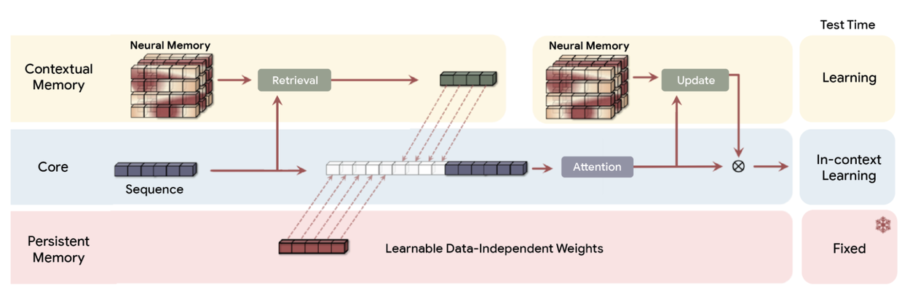
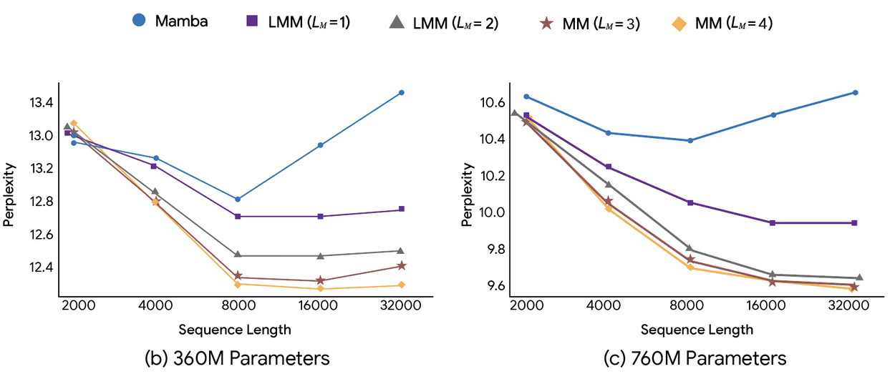
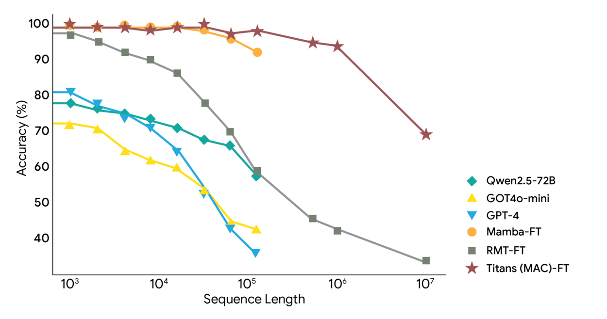

# Titans + MIRAS：帮助人工智能拥有长期记忆

2025年12月4日

阿里·贝赫鲁兹（Ali Behrouz），学生研究员；梅萨姆·拉扎维亚因（Meisam Razaviyayn），高级研究员；瓦哈卜·米罗克尼（Vahab Mirrokni），副总裁兼谷歌研究员，谷歌研究院

----

我们推出了 Titans 架构和 MIRAS 框架，它们允许 AI 模型在运行过程中更新其核心内存，从而更快地工作并处理海量上下文。

Transformer[架构](https://en.wikipedia.org/wiki/Transformer_(deep_learning))引入了[注意力](https://en.wikipedia.org/wiki/Attention_%28machine_learning%29)机制，彻底革新了[序列建模。](https://medium.com/machine-learning-basics/sequence-modelling-b2cdf244c233)注意力机制使模型能够回顾早期输入，从而优先处理相关的输入数据。然而，计算成本会随着序列长度的增加而急剧上升，这限制了基于Transformer的模型扩展到超长上下文的能力，例如全文档理解或基因组分析所需的上下文。

研究界探索了多种解决方案，例如高效的线性[循环神经网络](https://www.d2l.ai/chapter_recurrent-modern/index.html)（RNN）和[状态空间模型](https://huggingface.co/blog/lbourdois/get-on-the-ssm-train)（SSM），如[Mamba-2](https://arxiv.org/pdf/2405.21060)。这些模型通过将上下文压缩到固定大小来实现快速线性扩展。然而，这种固定大小的压缩无法充分捕捉超长序列中丰富的信息。

在两篇新论文[*Titans*](https://arxiv.org/abs/2501.00663)和[*MIRAS*](https://arxiv.org/pdf/2504.13173)中，我们提出了一种架构和理论蓝图，它结合了循环神经网络 (RNN) 的速度和 Transformer 的精度。Titans 是具体的架构（工具），而 MIRAS 是推广这些方法的理论框架（蓝图）。它们共同推进了测试时记忆的概念，即人工智能模型能够在运行过程中，无需专门的离线重新训练，就能通过整合更强大的“惊喜”指标（即意外信息）来维持长期记忆。

如 Titans 所展示的，MIRAS 框架实现了向实时自适应的重要转变。该架构并非将信息压缩成静态状态，而是随着数据流的流入主动学习并更新自身参数。这一关键机制使模型能够即时将新的、具体的细节融入其核心知识中。

## 泰坦：快速学习新知识

有效的学习系统需要独立但相互关联的记忆模块，这反映了[人脑短期记忆和长期记忆的分离](https://research.google/blog/introducing-nested-learning-a-new-ml-paradigm-for-continual-learning/)。

虽然注意力机制擅长精确的短期记忆，但Titans引入了一种新型的神经[长期记忆模块](https://arxiv.org/abs/2306.07174%23:~:text%3DLongMem%20can:%20*%20Memorize%20long%20past%20context,Yan%20*%20Jianfeng%20Gao%20*%20Furu%20Wei)。与传统循环神经网络（RNN）中固定大小的向量或矩阵记忆不同，该模块以深度神经网络（具体来说，是一个[多层感知器](https://en.wikipedia.org/wiki/Multilayer_perceptron)）的形式运行。这种记忆模块显著提升了模型的表达能力，使其能够在不丢失重要上下文的情况下概括大量信息。该模型并非简单地记录信息，而是理解并综合整个故事。

至关重要的是，Titans 并非被动地存储数据。它会主动学习*如何*识别并保留连接整个输入数据中各个标记的重要关系和概念主题。这种能力的关键在于我们称之为“意外指标”的东西。在人类心理学中，我们知道我们很容易忘记那些例行的、预期的事件，但却会记住那些打破常规的事情——意料之外的、令人惊讶的或情绪激动的事件。

Titans（MAC）架构概述。它使用长期记忆来压缩历史数据，然后将摘要整合到上下文中并传递给注意力机制。注意力机制随后可以决定是否需要关注历史摘要。

----

在 Titans 的背景下，“惊喜指标”是指模型检测到它当前记忆的内容与新输入告诉它的内容之间存在较大差异。

- *低意外度*：如果新词是“猫”，而模型的记忆状态已经预期会有一个动物词，那么梯度（意外度）就很低。它可以安全地跳过将“猫”这个词记忆到其永久长期记忆状态。
- *高意外度*：如果模型的记忆状态正在总结一份严肃的财务报告，而新的输入是一张香蕉皮的图片（意外事件），则梯度（意外度）将非常高。这表明新的输入很重要或异常，必须优先将其永久存储在长期记忆模块中。

该模型使用这种内部误差信号（梯度）作为数学上的等价物，表示“这是出乎意料且重要的！”这使得 Titans 架构能够选择性地仅使用最新颖和打破上下文的信息来更新其长期记忆，从而保持整个过程的快速和高效。

Titans 通过融入两个关键要素来改进这一机制：

1. *动量*：该模型同时考虑“瞬时意外”（当前输入）和“过去意外”（近期上下文流）。这确保了即使后续信息本身并不令人意外，也能被捕捉到相关的后续信息。
2. *遗忘（权重衰减）*：为了在处理极长序列时管理有限的内存容量，Titan 模型采用了一种自适应权重衰减机制。该机制如同一个遗忘门，允许模型丢弃不再需要的信息。

## MIRAS：序列建模的统一视图

序列建模的每一次重大突破——从现代的Transformer到速度极快的新型线性RNN——其底层本质上都是同一件事：一个高度复杂的[联想记忆](https://www.geeksforgeeks.org/computer-organization-architecture/associative-memory/)模块。

因此，MIRAS之所以独特且实用，在于它看待人工智能建模的方式。它不把不同的架构视为不同的问题解决方法，而是将其视为解决同一问题的不同途径：高效地将新信息与旧信息相结合，同时又不遗漏关键概念。

MIRAS 通过四个关键设计选择定义了序列模型：

- *内存架构*：存储信息的结构（例如，向量、矩阵或像 Titans 中的那种深度多层感知器）。
- *注意力偏差*：模型优化的内部学习目标，决定了模型优先考虑的内容。
- *记忆保持闸门*：记忆调节器。MIRAS 将“遗忘机制”重新解释为特定的[调节](https://dev.to/nareshnishad/day-27-regularization-techniques-for-large-language-models-llms-4af3)形式，以平衡新知识的学习和对过去知识的保留。
- *内存算法*：用于更新内存的优化算法。

<video class="glue-ambient-video__container" playsinline="" muted="true" loop="true" style="display: inline-block; vertical-align: baseline; box-sizing: border-box; border-radius: 4px; width: 956px;" src="video/titans-miras/MIRAS_Framework_Animation.mp4"></video>

*MIRAS框架概述。在MIRAS框架中，我们的目标是学习一个关联记忆，建立键值对之间的映射关系。对于每个词元，记忆模块会在内部优化其注意力偏差，同时利用其保持门来确保其不会偏离过去的状态。优化过程通过基于梯度的优化器完成。*

----

### 超越均方误差范式

几乎所有现有的成功序列模型都依赖[均方误差](https://en.wikipedia.org/wiki/Mean_squared_error)(MSE) 或[点积相似性](https://medium.com/advanced-deep-learning/understanding-vector-similarity-b9c10f7506de)来确定偏差和保留率。这种依赖性会使模型对异常值敏感，并限制其表达能力。

MIRAS 突破了这一局限，提供了一个生成式框架，用于探索更丰富的、受优化和统计的文献启发的设计空间。这使得创建具有[非欧几里得目标](https://en.wikipedia.org/wiki/Non-Euclidean_geometry)和正则化的新型架构成为可能。

利用 MIRAS，我们创建了三个特定的无注意力模型：

- *YAAD*：我们设计的这款 MIRAS 变体对重大错误或“异常值”（例如大型文档中的单个拼写错误）的敏感度较低。它采用更温和的数学惩罚（[Huber 损失](https://en.wikipedia.org/wiki/Huber_loss)）来处理错误，因此不会对个别问题反应过度。这使得模型在输入数据混乱或不一致的情况下也更加稳健。
- *MONETA*：该模型探索了使用更复杂、更严格的数学惩罚（称为[广义规范](https://en.wikipedia.org/wiki/Norm_(mathematics))）的方法。它研究了对于模型关注的内容和遗忘的内容，使用这些更严格的规则是否能够构建一个更强大、更稳定的长期记忆系统。
- *MEMORA*：该模型致力于通过强制记忆像严格的概率图一样运作，来实现最佳的记忆稳定性。通过这种约束，它确保每次更新记忆状态时，变化都得到控制和平衡。这保证了整合新信息的流程清晰稳定。几乎所有成功的现有序列模型都依赖[均方误差](https://en.wikipedia.org/wiki/Mean_squared_error)(MSE) 或[点积相似度](https://medium.com/advanced-deep-learning/understanding-vector-similarity-b9c10f7506de)来确定其偏差和保留率。这种依赖性会使模型对异常值敏感，并限制其表达能力。

## 实验及结果

我们对 Titans 以及 MIRAS 的变体（YAAD、MONETA、MEMORA）与包括[Transformer++](https://arxiv.org/abs/2003.04974)、[Mamba-2](https://arxiv.org/pdf/2405.21060)和[Gated DeltaNet](https://arxiv.org/pdf/2412.06464)在内的领先架构进行了严格的比较。我们还通过在基因组建模（DNA）和时间序列预测上测试 Titans 来进一步验证其通用性，证明该架构能够有效地泛化到文本以外的领域。

在标准语言建模数据集（[C4](https://c4model.com/)、[WikiText](https://huggingface.co/datasets/Salesforce/wikitext)）和[零样本推理任务](https://medium.com/@hetzer2807/zero-shot-reasoning-unleashed-the-magic-of-large-language-models-4e877dfe470e)（[HellaSwag](https://arxiv.org/abs/1905.07830)、PIQA）中，我们的模型始终表现出更高的准确率和[困惑度](https://en.wikipedia.org/wiki/Perplexity)（衡量语言建模模型在查看一段文本时感到惊讶的程度）。

### 深度记忆的力量

消融实验清楚地表明，记忆架构的深度至关重要。比较相同大小但深度不同的长期记忆模块时，记忆深度更深的模块在语言建模中始终表现出更低的困惑度。此外，它们还展现出更好的扩展性，即使序列长度显著增加，也能保持性能。

*记忆深度对 360M 和 760M 参数尺度下的困惑度的影响。*

----

### 语言建模和效率

在语言建模和常识推理任务中，Titans架构的性能优于目前最先进的线性循环模型（例如Mamba-2和Gated DeltaNet）以及规模相近的Transformer++基线模型。新型MIRAS变体（MONETA、YAAD和MEMORA）的性能也优于这些基线模型，验证了探索稳健的非均方误差（MSE）优化机制的优势。更重要的是，这些模型保持了高效的并行训练和快速的线性推理速度。

### 极强的长期情境回忆能力

这些新架构最显著的优势在于它们能够处理极其长的上下文。BABILong[基准测试](https://github.com/booydar/babilong)突显了这一点，该测试要求对分布在极长文档中的事实进行推理。在这种极具挑战性的环境下，Titans 的性能优于所有基线模型，包括像 GPT-4 这样规模庞大的模型，尽管其参数量要少得多。Titans 还进一步证明了其能够有效地扩展到超过 200 万个 token 的上下文窗口大小。

*泰坦在极端长上下文推理中的表现。*

----

## 结论

Titans 和 MIRAS 框架的引入标志着序列建模领域的重大进步。这些方法采用深度神经网络作为记忆模块，使其能够在数据输入过程中学习记忆，从而克服了固定大小循环状态的局限性。此外，MIRAS 提供了一个强大的理论统一框架，揭示了在线优化、联想记忆和架构设计之间的联系。通过超越标准的欧几里得范式，这项研究为新一代序列模型打开了大门，这些模型将循环神经网络的高效性与长上下文人工智能时代所需的表达能力相结合。
