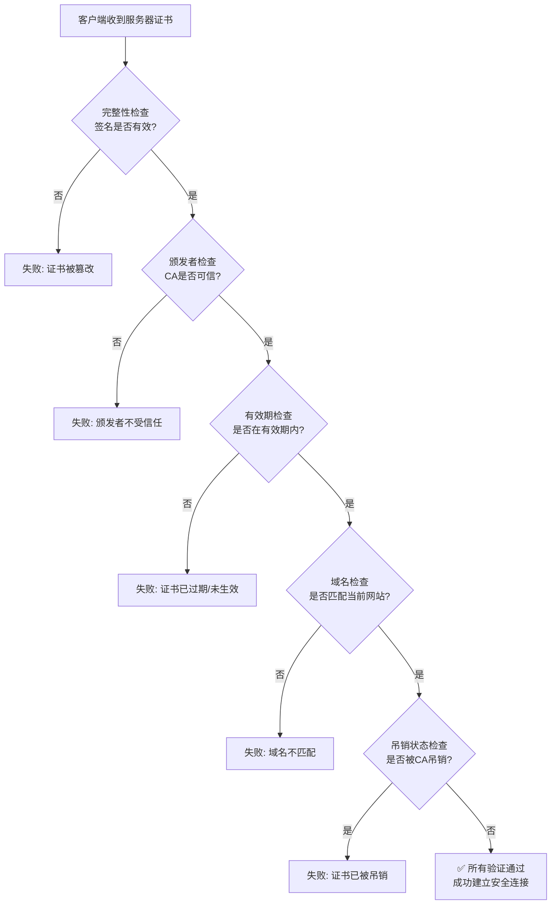

# 客户端验证服务器证书

客户端（如浏览器或操作系统）验证服务器证书的过程是一个复杂但设计精巧的多层安全检查链。以下是详细的步骤解析。

### 验证的核心目标

确保你正在连接的服务器（例如 `www.bank.com`）**确实是它声称的那个实体**，并且连接没有被中间人攻击。

---

### 详细验证步骤

当客户端收到服务器的证书后，会按顺序进行如下验证：

#### 1. 证书完整性验证：是否被篡改？

*   **操作**：客户端使用证书中指定的签名算法（如SHA256-RSA）和证书颁发机构（CA）的公钥，对证书的签名进行解密，得到一个哈希值（Hash A）。客户端自己再根据证书的主体内容（如版本号、序列号、有效期、公钥等信息）计算出一个哈希值（Hash B）。
*   **检查**：比较 Hash A 和 Hash B 是否完全相同。
*   **失败后果**：如果两者不同，证明证书在签发后被篡改过。客户端会立即终止连接，并抛出严重警告（如 `NET::ERR_CERT_INVALID`）。

#### 2. 证书颁发者验证：是否由可信机构签发？

*   **操作**：客户端检查签发该服务器证书的CA是否在自己的**信任的根证书存储库**中。
*   **信任库**：
    *   **操作系统**：Windows有它的信任库，macOS有它的，Linux发行版也有自己的。
    *   **浏览器/应用**：像Firefox这样的浏览器维护自己独立的信任库，不依赖操作系统。
*   **检查**：客户端会沿着**证书链**向上验证。服务器证书 -> 中间CA证书 -> 根CA证书。最终，必须有一个根CA证书是存在于客户端的信任库中的。
*   **失败后果**：如果找不到一个可信的根CA（例如，证书是自签名的或由私有CA签发且未被客户端信任），浏览器会发出“此证书颁发者不受信任”的警告。

#### 3. 证书有效期验证：是否在有效期内？

*   **操作**：客户端检查当前系统时间是否落在证书的“Not Before”和“Not After”时间之间。
*   **检查**：确保证书既没有过期也没有尚未生效。
*   **失败后果**：如果证书已过期或尚未生效，客户端会抛出“此证书已过期”的错误。

#### 4. 证书主体验证：域名是否匹配？

*   **操作**：客户端检查其正在访问的域名（例如 `www.example.com``）是否与证书中的 `Subject Alternative Name` (SAN) 字段或较旧的 `Common Name` (CN) 字段列出的域名完全匹配。
*   **通配符证书**：证书可能包含通配符，如 `*.example.com`，它可以匹配 `a.example.com` 或 `b.example.com`，但**不能**匹配 `a.b.example.com` 或 `example.com`本身。
*   **失败后果**：如果域名不匹配，说明你可能连接到了错误的服务器（或配置错误的服务器），浏览器会发出“此证书仅对 [另一个域名] 有效”的错误。

#### 5. 证书吊销状态验证：是否被提前作废？

即使证书是真实、可信且在有效期的，发行它的CA也可能因为某些原因（如私钥泄露、证书误发）而提前将其撤销。客户端必须检查这一点。

*   **检查方法**：
    *   **CRL (证书吊销列表)**：
        *   CA会定期发布一个所有已吊销证书序列号的列表（CRL）。
        *   客户端可以从证书中指定的 `CRL Distribution Points` URL下载这个列表，并检查当前证书的序列号是否在列表中。
        *   **缺点**：列表会越来越大，而且不是实时的。
    *   **OCSP (在线证书状态协议)**：
        *   客户端直接向证书中指定的 `OCSP Responder` (由CA运营) 发送一个查询请求，询问该证书的状态（良好/吊销/未知）。
        *   **缺点**：这会带来隐私问题（OCSP响应者知道你在访问哪个网站）和性能问题（增加握手延迟）。
    *   **OCSP Stapling (OCSP 装订)**： (**现代网站的标配**)
        *   为了解决OCSP的隐私和性能问题，服务器可以定期向CA的OCSP响应者获取一个**经过签名的OCSP响应**。
        *   在TLS握手时，服务器直接将这个签名的响应（“装订”）发送给客户端。
        *   客户端只需验证这个响应的签名来自可信CA，即可确保证书状态，而无需自己再去查询，既快又保护了隐私。
*   **失败后果**：如果证书被确认已吊销，客户端会抛出“此证书已被吊销”的错误。

---

### 总结与流程图

整个验证过程可以概括为以下流程图，它展示了层层递进的检查关卡：

**简单来说，客户端就像一个严格的安检官，它会逐一确认：**

1.  **这身份证是真的吗？**（防篡改）
2.  **是公安局发的吗？**（信颁发机构）
3.  **在有效期内吗？**（看有效期）
4.  **照片和本人对得上吗？**（对域名）
5.  **挂失了吗？**（查吊销状态）

**只有所有检查都通过，浏览器地址栏才会出现那把可爱的小锁图标，表示连接是安全可信的。** 任何一步失败，连接都会被中止，并向用户发出明确的安全警告。