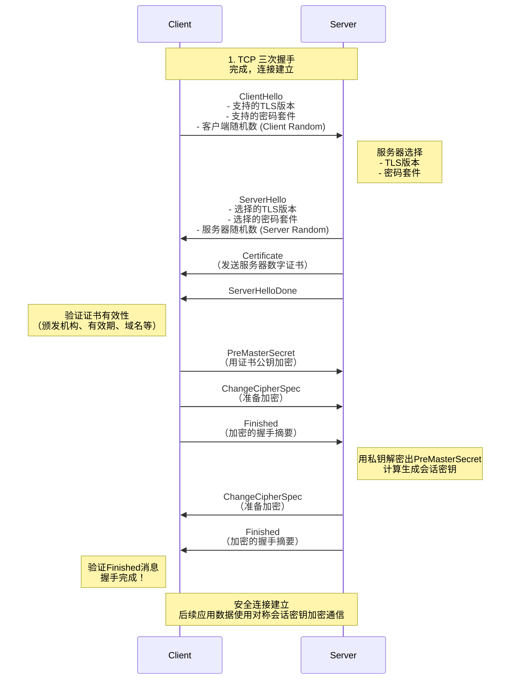

## HTTPS 的握手过程。

首先，要理解 HTTPS 的本质：**HTTP over SSL/TLS**。它是在 HTTP 协议之下、TCP 协议之上加入了一个安全层（SSL/TLS）。我们通常所说的“HTTPS 握手”，其实就是指建立安全连接的 **TLS 握手**。

整个过程的核心目标是：**在客户端和服务器之间安全地协商出一个对称会话密钥**，用于后续通信的加密和解密。使用对称加密是因为它的效率远高于非对称加密。

---

### TLS 握手详细步骤（基于 RSA 密钥交换）

下图直观地展示了 TLS 1.2 基于 RSA 的完整握手过程（最常见的类型）：

下面是每个步骤的详细说明：

#### 第一步：ClientHello (客户端问候)
客户端（通常是浏览器）向服务器发送一条消息，包含：
*   **支持的 TLS 版本**：如 TLS 1.0, 1.2, 1.3。
*   **支持的密码套件列表**：一个密码套件组合了密钥交换算法、对称加密算法和消息认证码算法。例如：`TLS_ECDHE_RSA_WITH_AES_128_GCM_SHA256`。
*   **一个客户端生成的随机数**：`Client Random`。这是后续生成会话密钥的种子之一。

#### 第二步：ServerHello (服务器问候)
服务器回应客户端一条消息，包含：
*   **选择的 TLS 版本**：从客户端提供的列表中选出的最高版本。
*   **选择的密码套件**：从客户端提供的列表中选出的一个套件。
*   **一个服务器生成的随机数**：`Server Random`。这也是生成会话密钥的种子之一。
*   **服务器的数字证书**：该证书包含了服务器的公钥、域名、颁发机构(CA)等信息，用于向客户端证明自己的身份。
*   **ServerHelloDone**：表示服务器问候结束。

> **证书验证**：客户端收到证书后，会进行一系列验证（是否在有效期内、证书的域名与访问的域名是否一致、是否由可信的证书颁发机构签发等）。如果验证失败，会向用户发出警告。

#### 第三步：客户端响应 (Premaster Secret 与加密)
证书验证通过后，客户端会：
1.  **生成 PreMaster Secret**：生成另一个随机数，称为 `PreMaster Secret`。
2.  **加密 PreMaster Secret**：用步骤二中收到的**服务器证书里的公钥**加密 `PreMaster Secret`，然后发送给服务器。
3.  **发送 Change Cipher Spec**：通知服务器，“之后的通信都将使用协商的密钥进行加密”。
4.  **发送 Finished 消息**：这是一条加密消息，包含之前所有握手消息的摘要，用于服务器验证握手过程是否被篡改。

#### 第四步：服务器最终响应
服务器收到客户端的消息后：
1.  **解密 PreMaster Secret**：使用自己的**私钥**解密出 `PreMaster Secret`。
2.  **生成会话密钥**：此时，客户端和服务器都拥有了三个随机数：`Client Random`、`Server Random` 和 `PreMaster Secret`。双方使用**相同的算法**，根据这三个随机数生成最终的**对称会话密钥**（Master Secret）。这个密钥只有客户端和服务器知道。
3.  **发送 Change Cipher Spec**：通知客户端，“我这边的加密也准备好了”。
4.  **发送 Finished 消息**：同样，这也是一条加密的握手消息摘要，供客户端验证。

#### 握手完成
客户端验证服务器的 `Finished` 消息后，整个安全通道就建立成功了。此后，所有的应用层（HTTP）数据都将使用刚刚生成的对称会话密钥进行加密传输。

---

### 更现代的方式：ECDHE 密钥交换

上述基于 RSA 的密钥交换有一个缺点：它不具备**前向安全性**。如果服务器的私钥未来某天被泄露，攻击者可以解密之前截获的所有通信记录（因为他可以解密出每次握手的 `PreMaster Secret`）。

因此，现在更主流的方式是使用 **ECDHE**（基于椭圆曲线的迪菲-赫尔曼密钥交换）作为密钥交换算法。其步骤与 RSA 类似，但关键区别在于：

*   在 `ServerHello` 后，服务器会发送它的 **DH 参数**（Server Params），并使用其私钥**签名**。
*   客户端收到后，验证签名，然后发送自己的 **DH 参数**（Client Params）。
*   双方使用对方的 DH 参数和自己的 DH 参数，通过 ECDHE 算法独立计算出相同的 `PreMaster Secret`，而不需要在网络上传输它。

这种方式即使服务器私钥未来泄露，也无法计算出过去的会话密钥，从而实现了前向安全性。TLS 1.3 已经强制要求使用具有前向安全性的密钥交换算法（如 ECDHE）。

---

### 总结

1.  **目的**：协商一个只有双方知道的对称会话密钥，并验证服务器身份。
2.  **核心步骤**：Hello -> 证书交换 -> 密钥交换 -> 生成密钥 -> 切换加密。
3.  **关键材料**：两个随机数（Client/Server Random）和一个预主密钥（PreMaster Secret）共同生成主密钥。
4.  **核心技术**：**非对称加密**（用于身份认证和安全地交换密钥种子） + **对称加密**（用于高效加密实际传输的数据）。
5.  **演进**：为了更好的安全性和性能，现代 TLS 握手更倾向于使用 ECDHE 密钥交换，并且 TLS 1.3 极大地简化了握手过程，将往返次数从 2-RTT 减少到了 1-RTT。